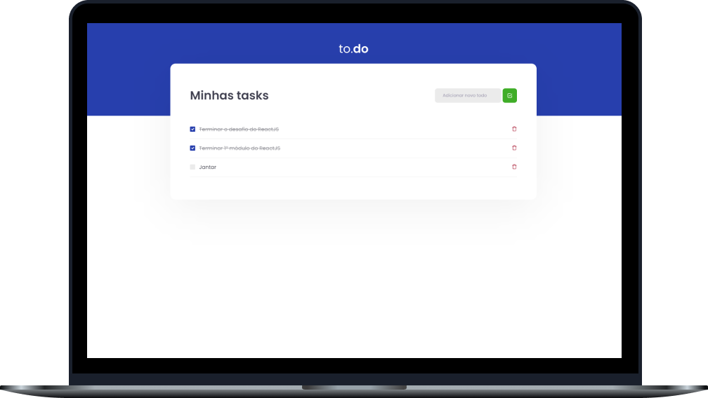

<h2 align="center">
  Desafio 01: Conceitos do ReactJS
</h2>

<p align="center">
  <a href="#-sobre-o-desafio">Sobre o Desafio</a>&nbsp;&nbsp;&nbsp;|&nbsp;&nbsp;&nbsp;
  <a href="#-tecnologias">Tecnologias</a>&nbsp;&nbsp;&nbsp;|&nbsp;&nbsp;&nbsp;
  <a href="#-instalação-e-uso">Instalação</a>&nbsp;&nbsp;&nbsp;|&nbsp;&nbsp;&nbsp;
  <a href="#-licença">Licença</a>
</p>

<p align="center">
  

  

  

  
</p>

<p align="center">
  
</p>

----

## 🚀 Sobre o desafio

Nesse desafio, o objetivo foi desenvolver um pequeno projeto muito utilizado para aprender novos conteúdos: o To-Do list! Onde reforçamos todos os conhecimentos das aulas, como hooks do React, componentização, webpack, babel, entre outros - e tudo isso com o nosso querido TypeScript.
 
## 🛠 Tecnologias

As seguintes tecnologias/ferramentas foram utilizadas na construção deste desafio:

- **[React](https://reactjs.org/)**
- **[TypeScript](https://www.typescriptlang.org/)**
- **[Babel](https://babeljs.io/)**
- **[Webpack](https://webpack.js.org/)**
- **[Sass](https://sass-lang.com/)**

> Veja o arquivo [package.json](https://github.com/carlosmfreitas2409/bootcamp-ignite-reactjs/blob/master/challenges/01-conceitos-do-reactjs/package.json)

## :information_source: Instalação e uso

Para executar este projeto, você deve possuir o Node e o Yarn instalado para configurar todas as dependências.

```
- Clone o repositório:
$ git clone https://github.com/carlosmfreitas2409/bootcamp-ignite-reactjs

- Entre no diretório:
$ cd challenges/01-conceitos-do-reactjs

- Para instalar as dependências:
$ yarn

- Execute a aplicação:
$ yarn dev

- Abra seu navegado em:
http://localhost:8080/
```

## 📝 licença

Esse projeto está sob a licença MIT. Veja o arquivo [LICENSE](LICENSE)

---

Feito com 💜 por Carlos Eduardo.