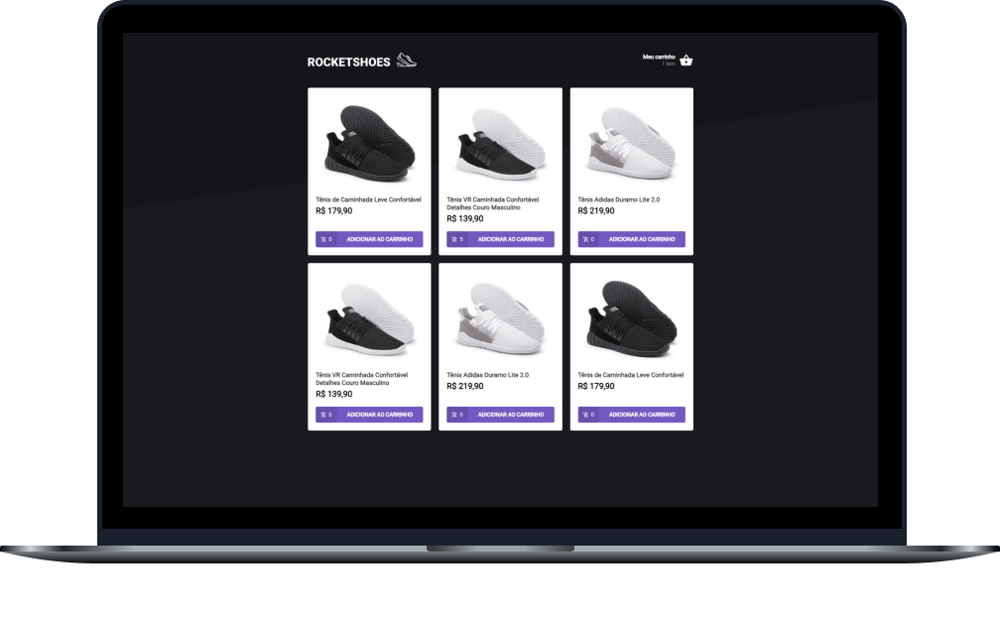

<h2 align="center">
  Desafio 02: Criando um hook de carrinho de compras
</h2>

<p align="center">
  <a href="#-sobre-o-desafio">Sobre o Desafio</a>&nbsp;&nbsp;&nbsp;|&nbsp;&nbsp;&nbsp;
  <a href="#-tecnologias">Tecnologias</a>&nbsp;&nbsp;&nbsp;|&nbsp;&nbsp;&nbsp;
  <a href="#-instalação-e-uso">Instalação</a>&nbsp;&nbsp;&nbsp;|&nbsp;&nbsp;&nbsp;
  <a href="#-licença">Licença</a>
</p>

<p align="center">
  

  

  

  
</p>

<p align="center">
  
</p>

----

## 🚀 Sobre o desafio

Nesse desafio, o principal objetivo foi criar um hook de carrinho de compras. As funcionalidades pedidas a serem implementadas nesse desafio foram:

- Adicionar um novo produto ao carrinho;
- Remover um produto do carrinho;
- Alterar a quantidade de um produto no carrinho;
- Cálculo dos preços sub-total e total do carrinho;
- Validação de estoque;
- Exibição de mensagens de erro;
- Entre outros.

**NOTA:** Para preservar os dados do carrinho mesmo se fecharmos a aplicação, utilizei a localStorage API.
 
## 🛠 Tecnologias

As seguintes tecnologias/ferramentas foram utilizadas na construção deste desafio:

- **[React](https://reactjs.org/)**
- **[TypeScript](https://www.typescriptlang.org/)**
- **[Axios](https://github.com/axios/axios)**
- **[Styled Components](https://styled-components.com/)**
- **[React-Toastify](https://github.com/fkhadra/react-toastify)**
- **[Polished](https://polished.js.org/)**

> Veja o arquivo [package.json](https://github.com/carlosmfreitas2409/bootcamp-ignite-reactjs/blob/master/challenges/02-componentizando-a-aplicacao/package.json)

## :information_source: Instalação e uso

Para executar este projeto, você deve possuir o Node e o Yarn instalado para configurar todas as dependências.

```
- Clone o repositório:
$ git clone https://github.com/carlosmfreitas2409/bootcamp-ignite-reactjs

- Entre no diretório:
$ cd challenges/02-componentizando-a-aplicacao

- Para instalar as dependências:
$ yarn

- Execute a Fake API (JSON Server):
$ yarn server

- Execute a aplicação:
$ yarn start

- Seu navegador irá abrir em:
http://localhost:3000/
```

## 📝 licença

Esse projeto está sob a licença MIT. Veja o arquivo [LICENSE](LICENSE)

---

Feito com 💜 por Carlos Eduardo.