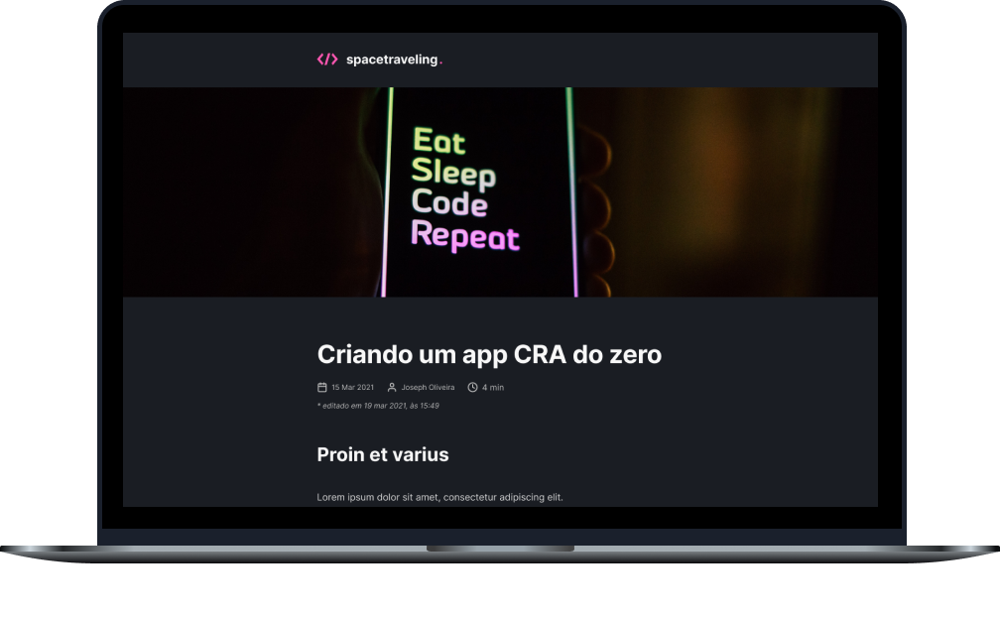

<h2 align="center">
  Desafio 03.1: Adicionando features ao blog
</h2>

<p align="center">
  <a href="#-sobre-o-desafio">Sobre o Desafio</a>&nbsp;&nbsp;&nbsp;|&nbsp;&nbsp;&nbsp;
  <a href="#-tecnologias">Tecnologias</a>&nbsp;&nbsp;&nbsp;|&nbsp;&nbsp;&nbsp;
  <a href="#-layout-do-app">Layout</a>&nbsp;&nbsp;&nbsp;|&nbsp;&nbsp;&nbsp;
  <a href="#-instalação-e-uso">Instalação</a>&nbsp;&nbsp;&nbsp;|&nbsp;&nbsp;&nbsp;
  <a href="#-licença">Licença</a>
</p>

<p align="center">
  

  

  

  
</p>

<p align="center">
  
</p>

----

## 🚀 Sobre o desafio

Neste desafio, nosso principal objetivo foi adicionar features a um projeto já existente. Utilizamos, como base, a solução desenvolvida no desafio anterior (`Criando um projeto do zero`).

Implementei no projeto as seguintes features:

- Comentários com Utterance;
- Preview do documento Prismic;
- Navegação entre post anterior e próximo;
- Informação de edição do post.

## 🛠 Tecnologias

As seguintes tecnologias/ferramentas foram utilizadas na construção deste desafio:

- **[React](https://reactjs.org/)**
- **[Next.js](https://nextjs.org/)**
- **[TypeScript](https://typescriptlang.org/)**
- **[Prismic](https://prismic.io/)**
- **[React-icons](https://react-icons.github.io/react-icons/)**
- **[Date-fns](https://date-fns.org/)**
- **[SASS](https://sass-lang.com/)**

> Veja o arquivo [package.json](https://github.com/carlosmfreitas2409/bootcamp-ignite-reactjs/blob/master/challenges/02.1-refactoring-classes-ts/package.json)

## 🎨 Layout do App

No link abaixo você encontra o layout do projeto em que tivemos de seguir. Lembrando que você precisa ter uma conta no [Figma](https://figma.com) para acessá-lo.

- [Layout Web](https://www.figma.com/file/0Y26j0tf1K2WB5c1ja5hov/Desafios-M%C3%B3dulo-3-ReactJS)


## :information_source: Instalação e uso

Para executar este projeto, você deve possuir o Node e o Yarn instalado para configurar todas as dependências.

```
- Clone o repositório:
$ git clone https://github.com/carlosmfreitas2409/bootcamp-ignite-reactjs

- Entre no diretório:
$ cd challenges/03.1-adicionando-features-ao-blog

- Para instalar as dependências:
$ yarn

- Execute a aplicação:
$ yarn start

- Navegue para:
http://localhost:3000/
```

## 📝 licença

Esse projeto está sob a licença MIT. Veja o arquivo [LICENSE](LICENSE)

---

Feito com 💜 por Carlos Eduardo.
