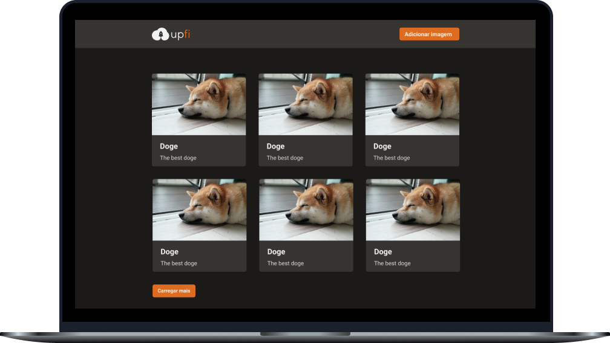

<h2 align="center">
  Desafio 04.1: Upload de imagens
</h2>

<p align="center">
  <a href="#-sobre-o-desafio">Sobre o Desafio</a>&nbsp;&nbsp;&nbsp;|&nbsp;&nbsp;&nbsp;
  <a href="#-tecnologias">Tecnologias</a>&nbsp;&nbsp;&nbsp;|&nbsp;&nbsp;&nbsp;
  <a href="#-layout-do-app">Layout</a>&nbsp;&nbsp;&nbsp;|&nbsp;&nbsp;&nbsp;
  <a href="#-instalação-e-uso">Instalação</a>&nbsp;&nbsp;&nbsp;|&nbsp;&nbsp;&nbsp;
  <a href="#-licença">Licença</a>
</p>

<p align="center">
  

  

  

  
</p>

<p align="center">
  
</p>

----

## 🚀 Sobre o desafio

Neste desafio, para práticar o que aprendemos durante a semana, recebemos uma aplicação com muitas funcionalidades e estilizações já implementadas. Ao realizar requisições para sua própria API Next.js, será retornado os dados do FaunaDB e do ImgDB (serviço de hospedagem de imagens). Tivemos que implementar:
- Infinite Queries e Mutations com React Query;
- Envio de formulário com React Hook Form;
- Exibição de Modal e Toast com Chakra UI;
- Entre outros.

## 🛠 Tecnologias

As seguintes tecnologias/ferramentas foram utilizadas na construção deste desafio:

- **[React](https://reactjs.org/)**
- **[Next.js](https://nextjs.org/)**
- **[TypeScript](https://typescriptlang.org/)**
- **[Chakra UI](https://chakra-ui.com/)**
- **[FaunaDB](https://fauna.com/)**
- **[Multer](https://github.com/expressjs/multer)**
- **[React Query](https://react-query.tanstack.com/)**
- **[Yup](https://github.com/jquense/yup)**

> Veja o arquivo [package.json](https://github.com/carlosmfreitas2409/bootcamp-ignite-reactjs/blob/master/challenges/04.1-upload-de-imagens/package.json)

## 🎨 Layout do App

No link abaixo você encontra o layout do projeto em que tivemos de seguir. Lembrando que você precisa ter uma conta no [Figma](https://figma.com) para acessá-lo.

- [Layout Web](https://www.figma.com/file/QKxbxCVwwlDLMrCtHae239/Desafio-2-M%C3%B3dulo-4-ReactJS)


## :information_source: Instalação e uso

Para executar este projeto, você deve possuir o Node e o Yarn instalado para configurar todas as dependências.

```
- Clone o repositório:
$ git clone https://github.com/carlosmfreitas2409/bootcamp-ignite-reactjs

- Entre no diretório:
$ cd challenges/04.1-upload-de-imagens

- Para instalar as dependências:
$ yarn

- Execute a aplicação:
$ yarn start

- Navegue para:
http://localhost:3000/
```

## 📝 licença

Esse projeto está sob a licença MIT. Veja o arquivo [LICENSE](LICENSE)

---

Feito com 💜 por Carlos Eduardo.
